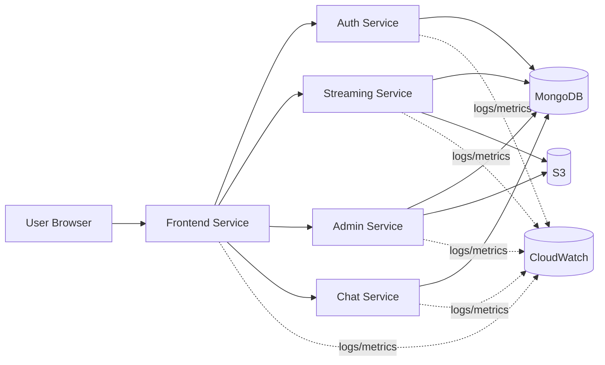

# GradedProject-OrchestrationScaling-assignment
# StreamingApp

Stream premium video content, host live watch parties, and manage your catalogue with a modern microservice architecture. The platform now ships with a production-ready admin portal, real-time chat, S3-backed adaptive streaming, and a redesigned cinematic frontend experience.

## Architecture

| Service | Port | Description |
| --- | --- | --- |
| `authService` | 3001 | User authentication, registration, JWT issuance |
| `streamingService` | 3002 | Video catalogue, S3 playback endpoints, public APIs |
| `adminService` | 3003 | Dedicated admin microservice for asset management and uploads |
| `chatService` | 3004 | Websocket + REST chat for live watch parties |
| `frontend` | 3000 | React SPA with revamped UI and integrated chat |
| `mongo` | 27017 | Shared MongoDB instance |

All backend services share common database models and utilities through `backend/common`.

## System architecture

### Services

- `frontend` (React + Nginx): port 80 (exposed via LoadBalancer in EKS in this project)
- `authService` (Node/Express): port 3001
- `streamingService` (Node/Express): port 3002
- `adminService` (Node/Express): port 3003
- `chatService` (Node/Socket.IO): port 3004
- `mongo`: port 27017

### High-level diagram



## Environment Configuration

Create an `.env` for each service (or export variables before running). All services accept the standard AWS credentials for S3 access.

### Auth Service (`backend/authService/.env`)
```ini
PORT=3001
MONGO_URI=mongodb://localhost:27017/streamingapp
JWT_SECRET=changeme
CLIENT_URLS=http://localhost:3000
AWS_ACCESS_KEY_ID=
AWS_SECRET_ACCESS_KEY=
AWS_REGION=ap-south-1
AWS_S3_BUCKET=
```

### Streaming Service (`backend/streamingService/.env`)
```ini
PORT=3002
MONGO_URI=mongodb://localhost:27017/streamingapp
JWT_SECRET=changeme
CLIENT_URLS=http://localhost:3000
AWS_ACCESS_KEY_ID=
AWS_SECRET_ACCESS_KEY=
AWS_REGION=ap-south-1
AWS_S3_BUCKET=
AWS_CDN_URL=
STREAMING_PUBLIC_URL=http://localhost:3002
```

### Admin Service (`backend/adminService/.env`)
```ini
PORT=3003
MONGO_URI=mongodb://localhost:27017/streamingapp
JWT_SECRET=changeme
CLIENT_URLS=http://localhost:3000
AWS_ACCESS_KEY_ID=
AWS_SECRET_ACCESS_KEY=
AWS_REGION=ap-south-1
AWS_S3_BUCKET=
```

### Chat Service (`backend/chatService/.env`)
```ini
PORT=3004
MONGO_URI=mongodb://localhost:27017/streamingapp
JWT_SECRET=changeme
CLIENT_URLS=http://localhost:3000
```

### Frontend build variables (`frontend/.env` or Docker build args)
```ini
REACT_APP_AUTH_API_URL=http://localhost:3001/api
REACT_APP_STREAMING_API_URL=http://localhost:3002/api
REACT_APP_STREAMING_PUBLIC_URL=http://localhost:3002
REACT_APP_ADMIN_API_URL=http://localhost:3003/api/admin
REACT_APP_CHAT_API_URL=http://localhost:3004/api/chat
REACT_APP_CHAT_SOCKET_URL=http://localhost:3004
```

## Running with Docker Compose

1. Populate the environment variables above (or rely on the defaults baked into `docker-compose.yml`).
2. Build and start the stack:
   ```bash
  docker compose --env-file ".env.example" up --build
   ```
3. Navigate to `http://localhost:3000` for the web app.

The compose file provisions MongoDB plus all four Node.js microservices. S3 credentials are optional for local testing—you can still browse seeded metadata, but streaming requires valid S3 objects.

## Local Development

Install dependencies for each service:

```bash
# auth service
cd backend/authService && npm install

# streaming service
cd ../streamingService && npm install

# admin service
cd ../adminService && npm install

# chat service
cd ../chatService && npm install

# frontend
cd ../../frontend && npm install
```

Run the services (in separate terminals) after starting MongoDB:

```bash
cd backend/authService && npm run dev
cd backend/streamingService && npm run dev
cd backend/adminService && npm run dev
cd backend/chatService && npm run dev
cd frontend && npm start
```

## Feature Highlights

- **S3-backed adaptive streaming** with secure signed uploads for admins.
- **Dedicated admin microservice** for video ingestion, metadata management, and featured curation.
- **Real-time chat** overlay in the player (Socket.IO + persistent message history).
- **Modern React experience** featuring cinematic hero sections, dynamic carousels, and responsive design.
- **Role-aware access control** across frontend routes and backend microservices.

## Testing

Automated tests are not yet included. Recommended smoke checks:

1. Register and log in through the web UI.
2. Upload a small video + thumbnail via the admin dashboard (requires valid S3 credentials).
3. Confirm playback from the browse page and verify that chat messages broadcast between multiple browser tabs.

## License

MIT © StreamFlix Team
